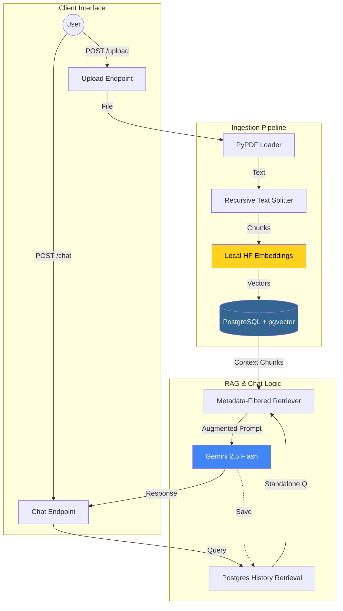

# Multi-Session RAG Chatbot with PostgreSQL & pgvector

A production-ready Retrieval-Augmented Generation (RAG) API built with **FastAPI**, **LangChain**, and **PostgreSQL**. This system allows users to upload PDF documents, index them into a vector database, and engage in context-aware conversations where the AI "remembers" both the uploaded document details and the chat history.

## 🚀 Key Technical Features

### 1. Hybrid Embedding Architecture

To ensure 100% reliability and bypass common cloud rate limits (like OpenAI/Gemini 429 errors), this project utilizes a **Hybrid AI approach**:

* **Local Embeddings**: Document indexing is performed using `sentence-transformers/all-MiniLM-L6-v2` locally. This ensures document processing is instant, free, and works without an internet-dependent quota.
* **Cloud LLM**: Generative responses are powered by **Google Gemini 2.5 Flash**, providing high-speed, state-of-the-art reasoning for chat.

### 2. Multi-Session Data Segregation

Architected specifically for multi-user environments, the system implements **Metadata Filtering**. Even though all data resides in one PostgreSQL table, documents and chat histories are strictly segregated by `session_id`. Users cannot "leak" information into another user's session.

### 3. Persistent Conversation Memory

Unlike basic RAG setups, this chatbot maintains a **Persistent Chat History** in PostgreSQL.

* **History-Aware Retrieval**: The system re-phrases user queries based on previous context before searching the vector store (e.g., if a user asks "Who is the author?" and follows with "Where is he from?", the system understands "he" refers to the author).
* **Postgres Storage**: All messages are stored in a `chat_history` table, allowing sessions to be resumed even after a server restart.

### 4. Vectorized Knowledge Base

Utilizes **PostgreSQL with the `pgvector` extension** as the primary vector store. This allows for high-performance similarity searches directly alongside relational data.

### 5. Production-Ready Docker Stack
This project is fully orchestrated to ensure a seamless "it works on my machine" experience across any platform:
  
* **One-Command Orchestration:** A single docker compose up command automates the entire setup of the FastAPI API, PostgreSQL database, and pgvector extensions.
* **Infrastructure-as-Code:** The environment is completely immutable, meaning it runs identically on any system without requiring manual Python or PostgreSQL installations.
* **Data Persistence & Security:** Dedicated Docker volumes protect your PDF data across restarts, while internal networking keeps all database traffic isolated and secure.

---

## 🛠️ Tech Stack

* **Backend**: FastAPI (Python 3.12+)
* **Orchestration**: LangChain (Modular v1.0 / `langchain-classic`)
* **Vector Search & Database**: PostgreSQL + `pgvector`
* **LLM**: Google Gemini 2.5 Flash
* **Embeddings**: HuggingFace (Local)
* **Containerization:** Docker & Docker Compose

---

## 📖 Detailed Setup Guide

Follow these instructions strictly to deploy the application on any system. (Cannot be run inside a venv)

### 1. Prerequisites

Ensure you have the following installed on your machine:

* **Docker Desktop**: [Download here](https://www.docker.com/products/docker-desktop/). Start the application and ensure the docker engine is running (whale icon is solid not blinking).
* **Git**: [Download here](https://www.google.com/search?q=https://git-scm.com/downloads) if not already installed.
* **Gemini API Key**: Visit [Google AI Studio](https://aistudio.google.com/) to get your free API key.


### 2. Get the Source Code

#### Option A: Clone via Git (Recommended)

Open your terminal and run:

```bash
git clone https://github.com/nihan-98716/Multi-Session-RAG-Chatbot-with-PostgreSQL-pgvector.git
cd Multi-Session-RAG-Chatbot-with-PostgreSQL-pgvector

```

#### Option B: Download ZIP (If Git is not working)

If you encounter errors with `git clone`, follow these steps:

1. **Download**: On this GitHub page, click the green **"<> Code"** button at the top right and select **"Download ZIP"**.
2. **Extract**: Locate the downloaded `Multi-Session-RAG-Chatbot-main.zip` file on your computer and extract its contents.
3. **Open in Editor**:
* Open **Visual Studio Code** (or your preferred editor).
* Go to `File > Open Folder...` and select the extracted folder.


4. **Open Terminal**: In VS Code, open the integrated terminal by pressing `Ctrl + ` `.


### 3. Environment Configuration

You must provide your API key to the application using a `.env` file. This file is excluded from Git for your security. (A new .env file must be made or else the application won't work)

1. Create a new file named `.env` in the root folder.
2. Paste the following content into it:
```env
GOOGLE_API_KEY=gemini_api_key_here
DATABASE_URL=postgresql+psycopg://myuser:mypassword@db:5432/mydatabase

```


*Note: Replace `gemini_api_key_here` with the key you got from Google.*

### 4. Build and Run with Docker

The entire stack (FastAPI + PostgreSQL + pgvector) is orchestrated via Docker Compose.

1. Firstly, run:
```bash
pip install -r requirements.txt

```
This prevents *imports not resolved error*.

2. In your terminal, run:
```bash
docker compose up --build

```

3. **Wait**: The first build will download the base images and install Python dependencies. This may take 5-30 minutes max depending on the internet speed.
4. **Success**: When you see `Uvicorn running on http://0.0.0.0:8000`, the app is ready!

---

## 🧪 Testing the Chatbot

### Phase A: Upload a PDF

1. Open your browser to `http://localhost:8000/docs`.
2. Locate the **`POST /upload`** endpoint and click **"Try it out"**.
3. In the `session_id` field, enter a unique ID (e.g., `f47ac10b-58cc-4372-a567-0e02b2c3d479`, make sure the string matches the 36-character format of the database schema).
4. Upload a PDF file and click **"Execute"**.

### Phase B: Chat with the PDF

1. Locate the **`POST /chat`** endpoint and click **"Try it out"**.
2. Use the **same** `session_id` from the upload step.
3. Enter your question in the `query` field (e.g., "What is this document about?") and click **"Execute"**.
4. Try reloading the page, then asking the chatbot another question with the same session ID.
   
---

## 🧹 Cleanup and Reset

To stop the services and completely reset the database (delete all history and vectors), run:

```bash
docker compose down -v

```


---

## 📐 Architecture Diagram

